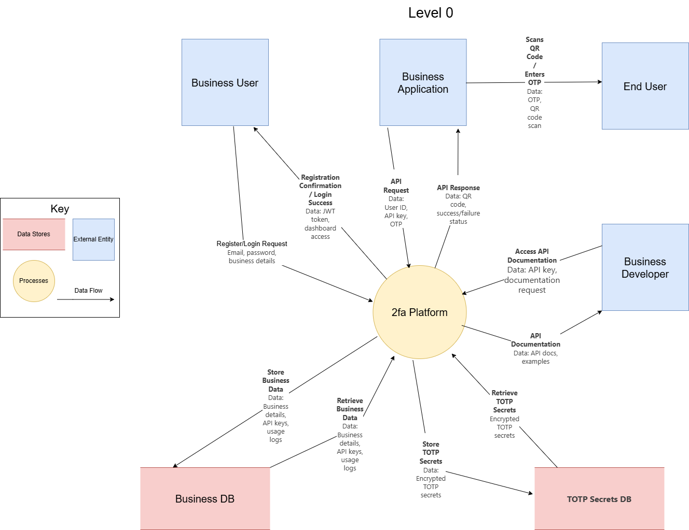
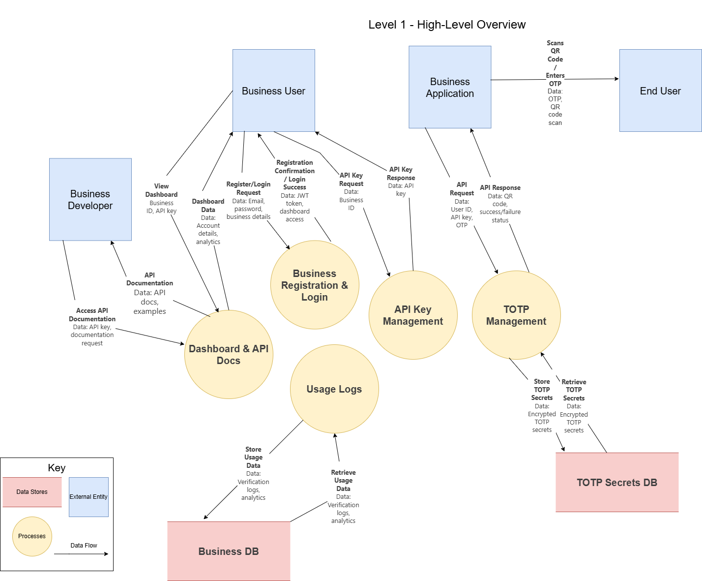
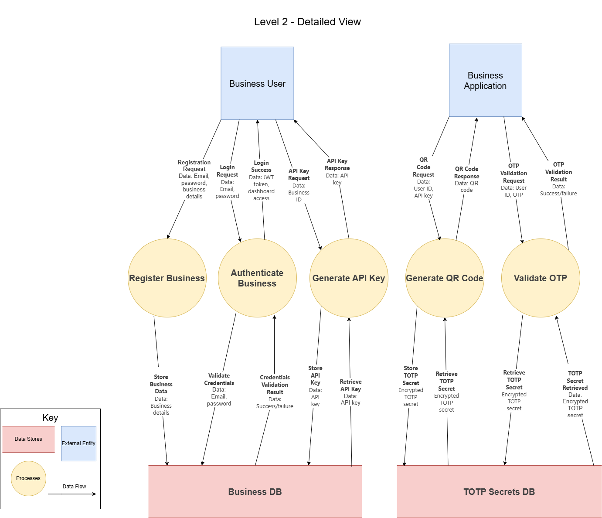
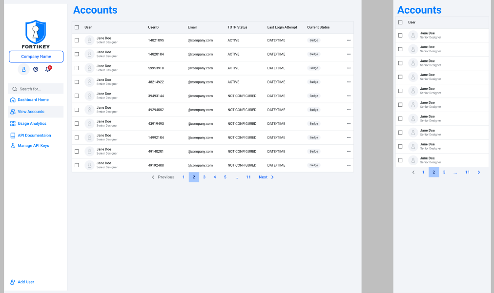
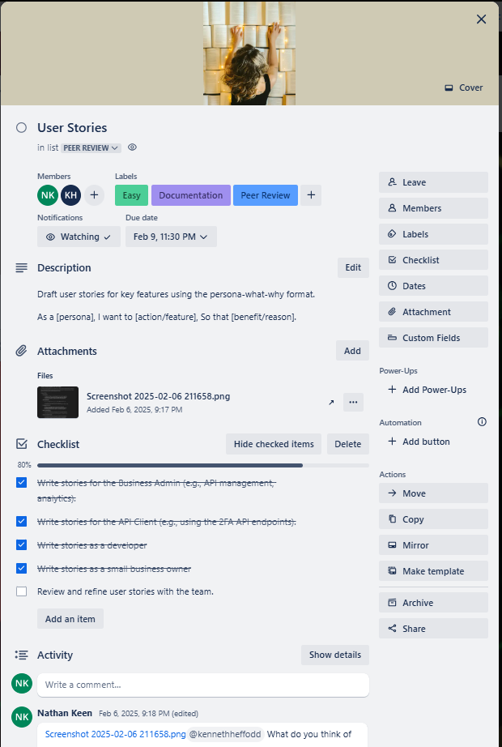
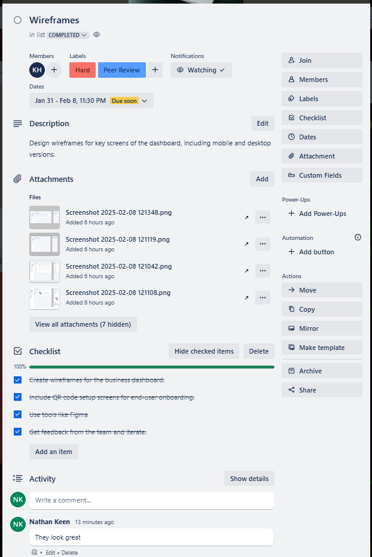
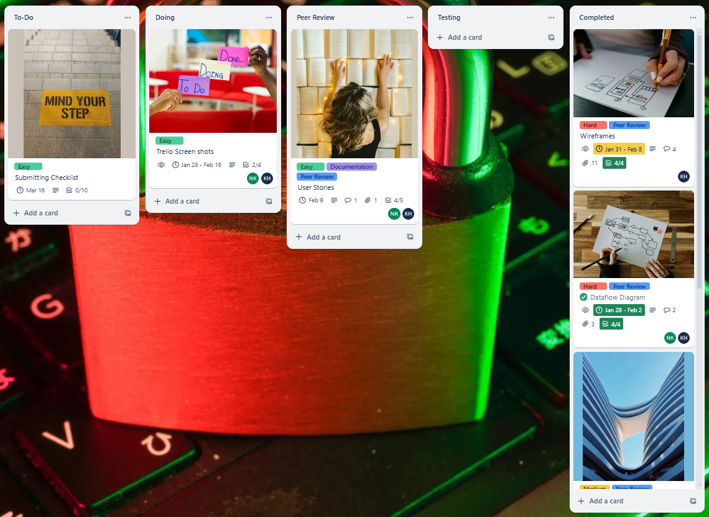
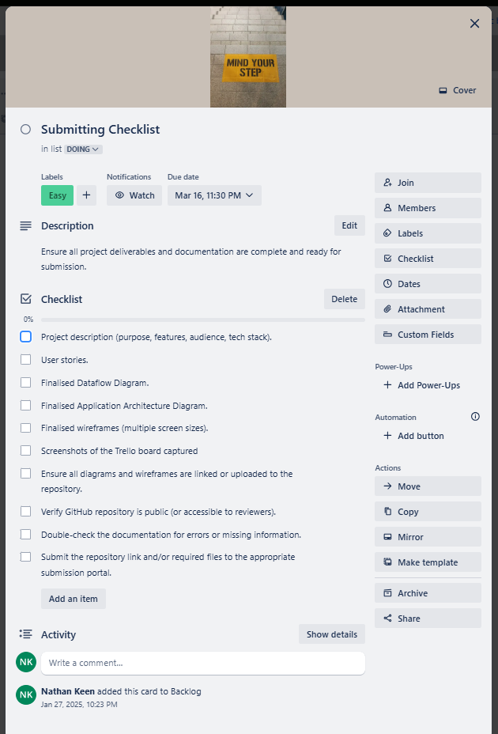
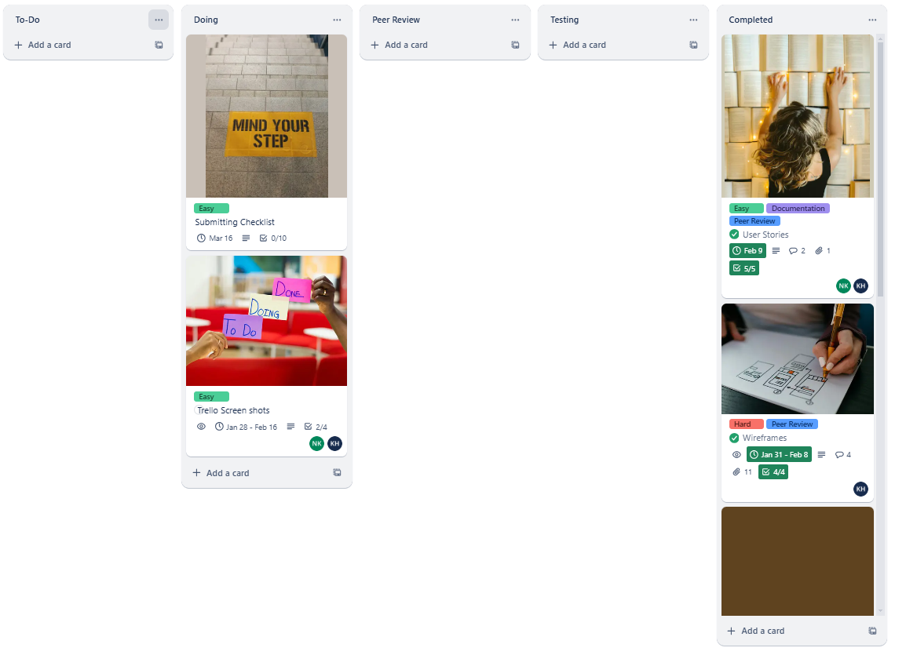

# FortiKey - Documentation T3A2-A

 ### Table of Contents:

- [Team Members](#team-members)
- [Discription](#description)
    - [Purpose](#purpose)
    - [Functionality/Features](#functionality--features)
    - [Target Audience](#target-audience)
    - [Tech Stack](#tech-stack)
    - [Additional Highlights](#additional-highlights)
- [Dataflow Diagram](#dataflow-diagram)
- [Application Architecture Diagram](#application-architecture-diagram)
- [User Stories](#user-stories)
- [Design](#design)
- [Project Management](#project-management)

### Team members

- Nathan Keen
- Kenny Hefford

## Description

### Purpose:
The purpose of this project is to provide businesses with a **easy-to-implement and secure Two-Factor Authentication (2FA) platform**.  The platform enables businesses to protect thier users' accounts from unathorised access by introducing a second layer of authentication beyond the more traditional *username and password* logins.  This platform is designed to help businesses address increasing security concerns in a cost-effective way, without requiring extensive technical expertise to intergrate the solution.  

Additionally, the platform offers a dashboard and API documentation to make integration seamless and user-friendly for developers working with businesses.

### Functionality / Features:

1. **Business Registration and Login:**
    - Businesses can register for an account using their email and password.  
    - Once logged in, they can access their API key for 2FA integration.  
    - Option to reset or regenerate API keys for security purposes.  

2. **Two-Factor Authentication API:**  
    - **Generate QR Code for TOTP Setup:** Businesses can use an endpoint to generate a QR code for their users to scan using apps like Google Authenticator or Authy.  
    - **Validate OTP:** Businesses can use another endpoint to validate OTPs entered by their users during login.  
    - **Usage Logs API:** Businesses can query usage logs to monitor 2FA activity (e.g., the number of successful and failed verifications).  

3. **Backup Codes:** 
    - Businesses can use the API to generate backup codes for users, which can be used in case they lose access to their TOTP device.  

4. **Business Dashboard:**  
    - **A web interface for businesses to:**  
        - View their account details and manage API keys.  
        - Access usage analytics (e.g., total number of 2FA verifications, failed OTP attempts).  
        - View and download API integration documentation.  
    - The dashboard will be responsive, providing seamless access on desktop and mobile devices.  

5. **API Documentation:**  
    - A detailed, developer-friendly guide to help businesses integrate 2FA into their applications.  
    - Includes examples of API requests and responses in JSON format, making the onboarding process smooth.  

6. **Security Features:**  
    - All sensitive data (e.g., passwords, API keys, TOTP secrets) is stored securely using best practices (e.g., hashed with bcrypt, encrypted TOTP secrets).  
    - API rate limiting middleware to prevent abuse (express-rate-limit library).  
    - Detailed logs and monitoring to track unauthorised attempts and system performance.  

### Target Audience:
1. **Small-to-Medium Businesses:**  
    - Companies looking for a simple, plug-and-play 2FA solution to enhance their platform's security.  
    - Businesses that don't have the technical bandwidth to build a custom 2FA solution.  

2. **Developers:**  
    - Developers tasked with adding 2FA functionality to a business's existing applications.  
    - Developers who need an easy-to-follow API with integration examples to minimise time-to-market.  

3. **Security-Conscious Enterprises:**  
    - Larger organisations seeking to add robust authentication mechanisms without diverting resources into building their own solutions.  

4. **Freelance Developers or Agencies:**  
    - Professionals providing services to *small-to-medium sized businesses* that need secure user authentication.  

### Tech Stack:  

- **Frontend:**
    - ***React.js*** for building the business dashboard with reusable components and responsive design.  
    - ***Axios*** for handling API requests between the dashboard and backend.  

- **Backend:**  
    - ***Node.js*** with ***Express*** to create scalable and secure API services.  
    - ***OTPAuth*** to handle TOTP generation and OTP validation.  
    - **Middlewares:** 
        - ***express-rate-limit*** to secure APIs from abuse and brute force attacks.  
        - ***Helmet*** Enhances security by setting HTTP headers to protect against common vulnerabilities. 
        - ***CORS*** Manages cross-origin resource sharing to allow secure communication between the frontend and backend.

- **Database:**  
    - ***MongoDB Atlas*** a cloud database solution to store business and user-related data, including *TOTP secrets and logs*.  

- **Authentication:**  
    - ***JSON Web Tokens (JWT)*** for session and API authentication.  

- **Hosting:**  
    - **Frontend:** ***Netlify*** for fast, reliable, and secure static hosting.  
    - **Backend:**  ***Render*** to host backend services with scalability in mind.  

- **Additional Tools and Libraries:**  
    - ***Bcrypt*** Used to hash and securely store passwords in the database.  
    - ***Dotenv:*** Manages environment variables for configuration (e.g., API keys, database credentials).  
    - ***Winston:*** A logging library for tracking system activity, errors, and performance metrics.  
    - ***Jest:*** A testing framework for writing unit and integration tests to ensure code reliability.  

### Additional Highlights:  
1. **Scalability:**  
    - Designed to handle multiple businesses and their users with minimal latency.  
    - Can support future additions like SMS-based OTP, email verification, or push notifications.  

2. **Flexibility:**  
    - Businesses can easily integrate the API into existing applications regardless of their tech stack.  

3. **Ease of Use:** 
    - Focused on delivering an intuitive dashboard and detailed API documentation to make integration effortless.  

4. **Security:**  
    - Sensitive data (e.g., passwords, API keys, TOTP secrets) is encrypted and stored securely.
    - Rate limiting and monitoring tools prevent abuse and ensure system performance.

- [Back to Top](#table-of-contents)  

## 	Dataflow Diagram

### Level 0: Context Diagram  
The Context Diagram presents a high-level view of the 2FA platform and its interactions with external entities.  The primary users include ***Business Users***, who register, log in, and manage API keys; ***Business Applications***, which integrate 2FA functionalities; ***End Users***, who interact with 2FA through OTPs or QR codes; and ***Developers***, who access API documentation.  The 2FA Platform serves as the central system, handling user authentication, OTP generation, and validation. Data stores, such as the Business Database (storing business details and API keys) and the TOTP Secrets Database (securely storing encrypted TOTP secrets), support these interactions.  Key data flows include registration and login requests, API requests for OTP validation, QR code generation, and access to API documentation.  

  

### Level 1: High-Level Overview  
At a more detailed level, the system is broken down into five main processes: ***Business Registration & Login***, which handles account creation and authentication; ***API Key Management***, responsible for generating and managing API keys; ***TOTP Management***, which deals with QR code generation, OTP validation, and TOTP secret management; ***Usage Logs***, which track 2FA activity for security and analytics; and ***Dashboard & API Docs***, which provide a user interface and documentation access. The Business Database and TOTP Secrets Database continue to support these processes, ensuring secure and efficient handling of business credentials, API keys, and TOTP secrets.  Data flows at this level specify how different system components interact, such as a business user generating an API key or an end user scanning a QR code.  

  

### Level 2: Detailed View  
At the most detailed level, each key process is further expanded to outline specific workflows and data exchanges.  ***Register Business*** & ***Authenticate Business*** show how business users register and authenticate using email and password credentials, storing data in the Business Database.  ***Generate API key*** outlines how business users request, generate, and retrieve API keys for integrating the 2FA system into their applications. ***Generate QR Code*** & ***Validate OTP*** covers the generation of QR codes, secure storage of TOTP secrets, and OTP validation by end users.  Data flows illustrate how the TOTP Secrets Database is accessed for encrypting and retrieving stored secrets during authentication. This level provides a granular view of the authentication process, ensuring the secure and efficient implementation of 2FA.

  

- [Back to Top](#table-of-contents)  

## Application Architecture Diagram

### 1. Frontend (React.js App)
The frontend is a **React.js application** to be deployed on **Netlify** that serves as the user interface for businesses.  It includes a **Business Dashboard** where businesses can register, log in, manage API keys, and view usage analytics.  Additionally, it provides **API Documentation** for developers to intergrate the 2FA API into their applications.  The frontend communicates with the backend via REST API calls to handle business operations and display relevant data.  Building with **Axios** for efficient API requests and **React Router** for seamless navigation, the frontend ensures a responsive and intuitive experience across devices.  

### 2. Backend (Express.js App)  
The backend is an **Express.js Application** that handles all user/business logic and API requests.  It will be deployed on **Render** and includes an **API Gateway** to manage incoming requests, enforce rate limiting, and route requests to the appropriate services.  The backend consists of several services: the **Business Service** for registration and API key management, the **TOTP Service** for QR code Generation and OTP validation, and the **Usage Logs Service** for tracking 2FA activity.  It interacts with the database to store and retrieve data and responds to requests from the frontend and external business applications.  Building with **Node.js**, the backend is scalable and secure, leveraging middleware like **express-rate-limit** and **Helmet** to protect against abuse and vulnerabilities.  

### 3. Database (MongoDB Atlas)  
The database, built with **MongoDB Atlas**, stores all persistent data for the application. It includes two main collections: the **Business Collection**, which stores business account details, API keys, and usage logs, and the **TOTP Secrets Collection**, which stores encrypted TOTP secrets and backup codes for end users. The database communicates with the backend to provide data for business operations, TOTP management, and usage analytics. MongoDB Atlas ensures high availability, scalability, and security, making it an ideal choice for handling sensitive data like TOTP secrets and business information.  

### 4. Business Applications  
**Business Applications** are external systems developed by businesses that integrate the 2FA API. These applications interact with the backend to provide 2FA functionality to their end users. They request QR codes for TOTP setup, send OTPs for validation, and handle user interactions (e.g., displaying QR codes and prompting for OTPs). The backend processes these requests and returns the necessary data (e.g., QR codes, validation results) to ensure secure authentication. The API is designed to be **tech stack-agnostic**, allowing businesses to integrate 2FA seamlessly into their existing applications, regardless of their programming language or framework.

- [Back to Top](#table-of-contents)  

## User Stories  

### Freelance Developer Integrates 2FA for Client Projects  
As a freelance developer building secure web applications for clients,
I want to seamlessly integrate a reliable Two-Factor Authentication (2FA) system using an easy-to-implement API,
So that I can enhance security for my clients' platforms and provide them with a trusted authentication solution.  

#### Acceptance Criteria  
1. ***API Integration***
    - I can generate API keys to securely integrate 2FA into my client's application.  
    - I can follow clear API documentation with example requests and responses.  
    - I can test the 2FA system in a sandbox environment before deployment.  

2. ***User Authentication***  
    - I can generate QR codes for users to scan with a TOTP authenticator app.  
    - I can validate OTP codes provided by users during login.  
    - I can generate backup codes for users in case they lose access to their TOTP app.  

3. ***Security & Best Practices***  
    - API keys are securely generated and can be rotated or deactivated.  
    - All sensitive authentication data is encrypted and never stored in plain text.  
    - Rate limiting prevents brute-force attacks on OTP validation endpoints.  

4. ***Monitoring & Debugging***   
    - I can view logs of 2FA events, including failed and successful OTP validations.  
    - I can access error messages and troubleshooting guides for integration issues.

5. ***Deployment & Client Handoff***  
    - I can provide my clients with a setup guide to enable 2FA on their platform. 
    - I can monitor API usage and ensure smooth operation post-deployment.  

### Business Admin Monitors 2FA Analytics & Manages API Keys
As a business administrator responsible for security oversight,
I want to monitor 2FA authentication analytics and manage API keys through the dashboard, so that I can track authentication trends, identify security risks, and ensure secure API integration.  

#### Acceptance Criteria  

1. ***API Key Management***  
    - I can generate API keys for integrating 2FA with my platform.  
    - I can revoke or regenerate API keys for security purposes.  
    - I can see a list of all active API keys  

2. ***2FA Analytics Dashboard***  
    - I can view the total number of 2FA authentication attempts over time.  
    - I can see a breakdown of successful vs. failed OTP validations.  
    - I can filter authentication logs by date range.  
    - I can download reports of 2FA activity for compliance and security audits.  

3. ***Security Monitoring***  
    - I can view trends in failed OTP attempts, helping identify possible brute-force attacks.  
    - I can receive alerts for unusual spikes in failed 2FA authentication attempts.  

### Business Owner Integrates 2FA for Enhanced Security
As a business owner managing a platform with user accounts,
I want to easily integrate a secure Two-Factor Authentication (2FA) system through a dashboard and an API,
so that I can protect my users from unauthorized access and build trust by improving security.

#### Acceptance Criteria:
1. ***Account Management***
    - I can register and log in using my email and password.
    - I can reset my password if needed.
2. ***Dashboard Features***
    - I can view and manage my API key(s).
    - I can see usage statistics, including successful and failed OTP validations.
    - I can access API documentation with integration guides and examples.
3. ***2FA API***
    - I can generate QR codes for TOTP setup.
    - I can validate OTPs entered by my users.
    - I can generate backup codes for users who lose access to their TOTP app.
4. ***Security***
    - API keys are securely generated and can be regenerated or deactivated.
    - Sensitive data is encrypted and stored securely.
    - API rate limiting prevents abuse.
5. ***Analytics and Reporting***
    - I can view 2FA activity trends and logs.
    - I can download detailed reports for compliance or review.

### End User Uses 2FA for Secure Login  
As an end user accessing a platform with sensitive information,  
I want to use Time-Based One-Time Passwords (TOTP) for enhanced login security,  
so that I can protect my account from unauthorized access and ensure my data remains secure.

#### Acceptance Criteria:  

1. **Account Setup**  
   - I can enable 2FA by scanning a QR code using my preferred authenticator app (e.g., Google Authenticator or Authy).  
   - I receive a set of backup codes during setup for emergency access.  

2. ***Login Process***  
   - After entering my username and password, I am prompted to input a TOTP generated by my authenticator app.  
   - I am notified if the TOTP is incorrect or expired, and I can retry with a valid code.  

3. ***Backup Codes***  
   - If I lose access to my authenticator app, I can use a backup code to log in.  
   - Backup codes can only be used once and can be regenerated if needed.  

4. ***Error Handling***
   - If I fail multiple login attempts, I am notified and may be required to wait for a cooldown period.  
   - I receive clear feedback on issues during login, such as expired codes or incorrect entries.  

5. ***Security Features***
   - I receive confirmation after successful logins via email or notifications.  
   - I can disable or reset 2FA from my account settings if necessary, with proper authentication.  

6. ***User Experience***
   - The process to set up, use, and manage 2FA is intuitive and easy to follow across devices.  
   - The interface provides guidance for troubleshooting common issues, like app setup or backup code use.  

- [Back to Top](#table-of-contents)  

## Design 
The goal of the UI was to promote a clean user-friendly and seamless navigation. For a business app focused on security, professionalism, and modernity, a blue + white + gray color scheme was appropriate. 

### Design
1. Headings, outlines and buttons: #007BFF
2. Normal Text: #343A40
3. Highlights: #F2F4F8
4. Backgrounds: #FFFFFF
5. Normal Font: Roboto
6. Dashboard/headings Font: Montserrat

### Logo

The logo design of a shield with a keyhole is inspired by core concepts of security, protection, and access control, which aligns perfectly with the purpose of this app. 

### WireFrames
The App will consist of 5 pages in total which will be responsive to Desktop and Mobile. Dashboard will be organised in Tabs.
1. Landing 
2. Login 
3. Sign Up 
4. QR Scan 
5. Dashboard
    - Dashboard Overview
    - Accounts
    - Usage Analytics
    - API Documentation
    - Manage API Key's
    - Admin Dashboard

#### Landing 
Simple Landing Page that gives potential customers an overview of the app and ability to contact the sales team. 

#### Login
Easy to use Login Page using your company/business email address.

#### Company Sign up
Sign up using the QR Code.

#### QR Scan
Generated QR Codes.

#### Dashboards
***Dashboard Overview***
Quick Overview of company stats.

***Accounts***
View users in your own business.

***Usage Analytics***
Access Usage Analytics

***API Documentation***
Your guides for any API related tasks

***Manage API Key's***
Manage your current keys.

***Admin Dashboard***
Company Dashboard to view current businesses. The company will say administrator.

- [Back to Top](#table-of-contents)  

## Project Management
### Why We Used Kanban in Trello  
For this project, we used Trello with the Kanban methodology to streamline task management and keep the workflow organised.  Trello's visual board made it easy to track progress, assign tasks, and collaborate efficiently.

By structuring our board with ***Backlog***, ***To Do***, ***Doing***, ***Peer Review***, ***Testing*** and ***Complete*** columns, we ensured that tasks moved smoothly through different stages.  This helped the team stay focused, identify bottlenecks early, and adjust priorities as needed.

Kanban's flexibility and transparency allowed us to manage work efficiently while keeping everyone aligned on project goals.  Trello's simple drag-and-drop interface made it easy to update tasks, maintain visibility, and ensure steady progress throughout development.  

* Trello board link - https://trello.com/b/L7dyKFHE/fortikey

### Week 1
  

   

  

  

  

### Week 2
   

  

  

### Week 3 
  

- [Back to Top](#table-of-contents)

# Frontend Libraries and Technologies  

The FortiKey frontend is built with a modern React stack, utilizing several key libraries to create a responsive, feature-rich, and secure user interface for managing 2FA.  

## Core Libraries  

### React (v19.0.0)  
- **Purpose**: Core frontend framework providing the foundation for our single-page application.  
- **Implementation**: Powers all UI components, state management, and rendering logic.  
- **Benefits**: Enables component reusability, efficient DOM updates, and a modular codebase.  

### React Router (v6.29.0)  
- **Purpose**: Manages navigation and routing between different views.  
- **Implementation**: Handles routes for dashboard, login, registration, API documentation, and settings pages.  
- **Benefits**: Creates seamless transitions between pages without full page reloads.  

### Axios (v1.8.1)  
- **Purpose**: Facilitates HTTP requests to the backend API.  
- **Implementation**: Manages all data fetching, authentication requests, and API key operations.  
- **Benefits**: Provides consistent error handling, request/response interceptors, and Promise-based syntax.  

## UI Framework  

### Material UI (v6.4.5)  
- **Purpose**: Comprehensive UI component library based on Google's Material Design.  
- **Components Used**:  
  - Core components (`@mui/material`)  
  - Icon set (`@mui/icons-material`)  
  - Data Grid (`@mui/x-data-grid`) for displaying usage logs and API keys  
  - Emotion styling engine (`@emotion/react`, `@emotion/styled`)  
- **Benefits**: Provides professional, accessible, and responsive components that maintain visual consistency.  

### React Pro Sidebar (v0.7.1)  
- **Purpose**: Creates the dashboard's navigation sidebar.  
- **Implementation**: Implements collapsible, responsive navigation for dashboard sections.  
- **Benefits**: Enhances dashboard usability with intuitive navigation patterns.  

## Data Visualization  

### Chart.js (v4.4.8) with React-Chartjs-2 (v5.3.0)  
- **Purpose**: Creates interactive data visualizations for analytics.  
- **Implementation**: Displays 2FA usage trends, security metrics, and account activity.  
- **Benefits**: Helps businesses visualize and understand their authentication patterns and security status.  

## Specialized Components  

### React Syntax Highlighter (v15.6.1)  
- **Purpose**: Provides code formatting and highlighting.  
- **Implementation**: Used in API documentation to display code examples with proper syntax highlighting.  
- **Benefits**: Improves readability of API integration examples for developers.  

## Testing Framework  

### Jest with React Testing Library  
- **Purpose**: Comprehensive testing framework for React applications.  
- **Implementation**:  
  - **Jest** as the test runner and assertion library.  
  - **React Testing Library** (`@testing-library/react` v16.2.0) for component testing.  
  - **User Event** (`@testing-library/user-event` v14.6.1) for simulating user interactions.  
  - **DOM Testing Library** (`@testing-library/dom` v10.4.0) for DOM queries.  
  - **Jest DOM** (`@testing-library/jest-dom` v6.6.3) for custom DOM matchers.  
- **Benefits**: Ensures UI reliability through unit and integration tests, with configured test coverage reporting.  
- **Configuration**: Custom configuration for test matching patterns, module name mapping, and transform ignore patterns.  

## Development and Performance  

### Web Vitals (v2.1.4)  
- **Purpose**: Library for measuring real user performance metrics.  
- **Implementation**: Tracks Core Web Vitals and other performance metrics.  
- **Benefits**: Helps monitor and improve application performance and user experience. 

# Backend Libraries and Technologies

The FortiKey backend leverages Node.js with Express to deliver a secure, scalable 2FA platform. Based on your `package.json`, here's a detailed breakdown of the backend technologies used:

## Core Framework
**Express (v4.21.2)**
- **Purpose:** Fast, unopinionated web framework for Node.js  
- **Implementation:** Handles routing, middleware integration, and request processing  
- **Benefits:** Provides a minimal yet powerful structure for building APIs with excellent performance  

## Authentication & Security
**JSON Web Tokens (`jsonwebtoken` v9.0.2)**
- **Purpose:** Securely transmit information between parties as a JSON object  
- **Implementation:** Used for business authentication and API authorization  
- **Benefits:** Enables stateless authentication with digital signature verification  

**Bcrypt (v5.1.1)**
- **Purpose:** Password hashing library  
- **Implementation:** Securely stores user passwords and sensitive credentials  
- **Benefits:** Implements salted hashing with adjustable work factors to remain secure against evolving threats  

**Helmet (v8.0.0)**
- **Purpose:** Security middleware that sets HTTP headers  
- **Implementation:** Configures HTTP headers to protect against common web vulnerabilities  
- **Benefits:** Helps secure Express apps by setting various HTTP headers to prevent attacks like XSS  

### Two-Factor Authentication
**OTPAuth (v9.3.6)**
- **Purpose:** One-time password authentication library  
- **Implementation:** Generates and validates TOTP codes for 2FA  
- **Benefits:** Provides RFC 4226 (HOTP) and RFC 6238 (TOTP) compliant implementations  

**Crypto (v1.0.1)**
- **Purpose:** Node.js cryptographic functionality  
- **Implementation:** Provides cryptographic operations for securing TOTP secrets  
- **Benefits:** Enables encryption/decryption of sensitive authentication data  

### Database
**Mongoose (v8.10.1)**
- **Purpose:** MongoDB object modeling tool  
- **Implementation:** Defines schemas, performs validation, and handles database operations  
- **Benefits:** Adds a layer of structure to MongoDB with built-in type casting and validation  

### API Protection & Performance
**Express Rate Limit (v7.5.0)**
- **Purpose:** Basic rate-limiting middleware  
- **Implementation:** Limits repeated requests to endpoints  
- **Benefits:** Helps protect against brute-force attacks and API abuse  

**CORS (v2.8.5)**
- **Purpose:** Cross-Origin Resource Sharing middleware  
- **Implementation:** Enables controlled API access from different domains  
- **Benefits:** Provides security while allowing legitimate cross-origin requests  

### HTTP Client
**Axios (v1.7.9)**
- **Purpose:** Promise-based HTTP client  
- **Implementation:** Makes HTTP requests to external services or APIs  
- **Benefits:** Offers an easy-to-use API with automatic transforms for JSON data  

### Logging & Monitoring
**Winston (v3.17.0)**
- **Purpose:** Universal logging library  
- **Implementation:** Records application events, errors, and security incidents  
- **Benefits:** Provides multiple transports for logs with customizable levels and formats  

### Development & Configuration
**Dotenv (v16.4.7)**
- **Purpose:** Loads environment variables from `.env` files  
- **Implementation:** Manages configuration across different environments  
- **Benefits:** Keeps sensitive credentials and configuration separate from code  

**Nodemon (v3.1.9)**
- **Purpose:** Monitors for changes and automatically restarts the server  
- **Implementation:** Used in development for improved developer experience  
- **Benefits:** Increases development efficiency with automatic application reloading  

### Testing
**Jest (v29.7.0)**
- **Purpose:** JavaScript testing framework  
- **Implementation:** Runs unit and integration tests with built-in assertion library  
- **Benefits:** Provides a complete testing solution with mocking, coverage reports, and snapshot testing  

**Supertest (v7.0.0)**
- **Purpose:** HTTP assertion library  
- **Implementation:** Tests API endpoints by making HTTP requests  
- **Benefits:** Simplifies API testing with a fluent API for assertions on HTTP responses  

# Frontend Testing Process

The FortiKey frontend implementation includes extensive testing to ensure reliability, functionality, and security. Our testing process leverages industry-standard tools while focusing on both automated testing and user-centered validation.

### Testing Framework

Our application uses the following testing tools, as defined in our package.json:

json
"devDependencies": {
  "@testing-library/dom": "^10.4.0",
  "@testing-library/jest-dom": "^6.6.3",
  "@testing-library/react": "^16.2.0",
  "@testing-library/user-event": "^14.6.1",
  "jest-environment-jsdom": "^29.7.0"
}

This combination provides:
- **Jest**: As our test runner and assertion library
- **React Testing Library**: For component testing with a focus on user behavior
- **Testing Library User Event**: For simulating realistic user interactions
- **DOM Testing Library**: For querying DOM elements in tests

### Test Organization

Our tests are structured to mirror the application architecture:

- **src/tests/**
  - **__mocks__/** → Mock implementations for testing
  - **components/** → Tests for UI components
  - **context/** → Tests for React context providers
  - **data/** → Test data fixtures
  - **pages/** → Tests for page components
  - **services/** → Tests for API services
  - **utils/** → Tests for utility functions
  - **app.test.jsx** → Tests for the main App component
  - **debug.test.jsx** → Debugging/utility tests
  - **testHelpers.js** → Testing helper functions
  - **testUtils.js** → Testing utilities
  - **testWrappers.jsx** → Test wrapper components

This organization ensures comprehensive test coverage across all aspects of the application.

### Local Development Testing

During development, we use React's development server to test in real-time:

bash
# Start the development server 
npm start

This allows developers to:
- Immediately see the effects of code changes
- Test functionality in a development environment
- Debug issues with React Developer Tools
- Verify API integrations with backend services

### Running Automated Tests

Our package.json defines specific scripts for running tests:

json
"scripts": {
  "test": "react-scripts test",
  "test:coverage": "react-scripts test --coverage --watchAll=false"
}

These commands enable:

bash
# Run tests in watch mode during development
npm test

# Generate a comprehensive coverage report
npm test:coverage

### Example: UsageAnalytics Component Testing

The UsageAnalytics component, one of our most complex UI elements, includes extensive test coverage as demonstrated in usageanalytics.test.jsx. Here are key test scenarios implemented:

1. **Basic Rendering and API Integration**
   
javascript
   test("renders without crashing and makes at least one API call", async () => {
     await act(async () => {
       render(
         <MemoryRouter>
           <UsageAnalytics />
         </MemoryRouter>
       );
     });
     
     // Force effects to run
     await act(async () => {
       jest.runAllTimers();
       await Promise.resolve(); // Flush promises
     });
     
     // Verify that the API call was made
     expect(apiService.getTOTPStats).toHaveBeenCalled();
     expect(screen.getByText("Usage Analytics")).toBeInTheDocument();
   });

2. **Interactive Filtering**
   
javascript
   test("changes time period when selection changes", async () => {
     // Component setup and rendering...
     
     // Find the time range select and change value
     const timeRangeSelect = screen.getByLabelText("Time Range");
     
     apiService.getTOTPStats.mockClear();
     
     await act(async () => {
       fireEvent.change(timeRangeSelect, { target: { value: "7" } });
       jest.runAllTimers();
       await Promise.resolve();
     });
     
     // Should trigger a new API call
     expect(apiService.getTOTPStats).toHaveBeenCalled();
   });

3. **Data Visualization Testing**
   
javascript
   test("changes chart type when selection changes", async () => {
     // Component setup and rendering...
     
     // Find the chart type select and change to devices
     const chartTypeSelect = screen.getByLabelText("Chart Type");
     
     apiService.getDeviceBreakdown.mockClear();
     
     await act(async () => {
       fireEvent.change(chartTypeSelect, { target: { value: "devices" } });
       jest.runAllTimers();
       await Promise.resolve();
     });
     
     // Should call the device breakdown API
     expect(apiService.getDeviceBreakdown).toHaveBeenCalled();
   });

4. **User Interaction: Data Refresh**
   
javascript
   test("refreshes data when refresh button is clicked", async () => {
     // Component setup and rendering...
     
     // Clear mock to track next calls
     apiService.getTOTPStats.mockClear();
     
     // Find and click the refresh button
     const buttonElement = container.querySelector(
       '[title="Refresh Data"] button'
     );
     
     await act(async () => {
       buttonElement.click();
       jest.runAllTimers();
       await Promise.resolve();
     });
     
     // Now we should expect the API to have been called
     expect(apiService.getTOTPStats).toHaveBeenCalled();
   });

5. **Error Handling**
   
javascript
   test("handles API error state correctly", async () => {
     // Set up API to return an error
     apiService.getTOTPStats.mockRejectedValueOnce(new Error("API Error"));
     
     // Component setup and rendering...
     
     // Wait for the error alert to appear
     await waitFor(() => {
       expect(screen.getByTestId("alert-error")).toBeInTheDocument();
     });
     
     // Error message should contain the error text
     expect(screen.getByTestId("alert-error").textContent).toContain(
       "Unable to load analytics data"
     );
     
     // Should show error toast
     expect(mockShowErrorToast).toHaveBeenCalled();
   });

6. **Loading States**
   
javascript
   test("displays loading state initially", async () => {
     render(
       <MemoryRouter>
         <UsageAnalytics />
       </MemoryRouter>
     );
     
     // Should show loading indicator initially
     expect(screen.getByTestId("circular-progress")).toBeInTheDocument();
     
     // Complete loading
     await act(async () => {
       jest.runAllTimers();
       await Promise.resolve();
     });
     
     // Loading should disappear
     expect(screen.queryByTestId("circular-progress")).not.toBeInTheDocument();
   });

### Production Build Verification

Before deployment, we verify our production build:

bash
# Generate production-optimized build
npm run build

# Serve the production build locally for testing
npx serve -s build

This ensures that the optimized code works as expected in a production environment.

### Client User Testing

As this project did not currently have any real world clients we did our own testing. However, this is the process of how we would do client user testing:

1. **Guided Feature Walkthroughs**
   - Demonstrated key features to client representatives
   - Gathered feedback on usability and workflow efficiency
   - Identified areas for improvement based on client needs

2. **Task-Based Testing**
   - Asked clients to perform specific tasks (generating API keys, viewing analytics)
   - Observed their interactions and pain points
   - Made iterative improvements based on observations

3. **Production Environment Testing**
   - Provided access to staging environments for client testing
   - Collected feedback through structured forms
   - Prioritized fixes and enhancements based on client input

## Test Coverage Results for Frontend

| File | % Stmts | % Branch | % Funcs | % Lines | Uncovered Line #s |
|------|---------|----------|---------|---------|-------------------|
| All files | 83.49 | 58.11 | 84.81 | 84.41 | |
| src | 100 | 100 | 100 | 100 | |
| src/App.js | 100 | 100 | 100 | 100 | |
| src/pages/apidocumentation | 81.81 | 100 | 33.33 | 81.81 | |
| src/pages/apidocumentation/index.jsx | 81.81 | 100 | 33.33 | 81.81 | 48,163 |
| src/pages/landing | 80 | 100 | 66.66 | 80 | |
| src/pages/landing/index.jsx | 80 | 100 | 66.66 | 80 | 65,238 |
| src/pages/usageanalytics | 84.61 | 63.07 | 92 | 85.45 | |
| src/pages/usageanalytics/index.jsx | 84.61 | 63.07 | 92 | 85.45 | 115,135,145,151,166,198-200,216-235,242,265,283-287,392,597-601 |
| src/pages/viewaccounts | 81.33 | 55.88 | 84.61 | 82.43 | |
| src/pages/viewaccounts/index.jsx | 81.33 | 55.88 | 84.61 | 82.43 | 68,108-109,172-210 |
| src/services | 85.41 | 49.45 | 100 | 85.41 | |
| src/services/apiservice.js | 85.41 | 49.45 | 100 | 85.41 | 105,120,138,154,174,190,208,267,280-283,308,319-320,342,360,380,391-392,410,445 |
| src/tests | 64.28 | 75 | 42.85 | 75 | |
| src/tests/testUtils.js | 64.28 | 75 | 42.85 | 75 | 20,75,91 |

## Test Summary

Test Suites: 26 passed, 26 total
Tests: 152 passed, 152 total

This comprehensive approach to testing ensures that FortiKey delivers a reliable, secure, and user-friendly experience for businesses implementing two-factor authentication.