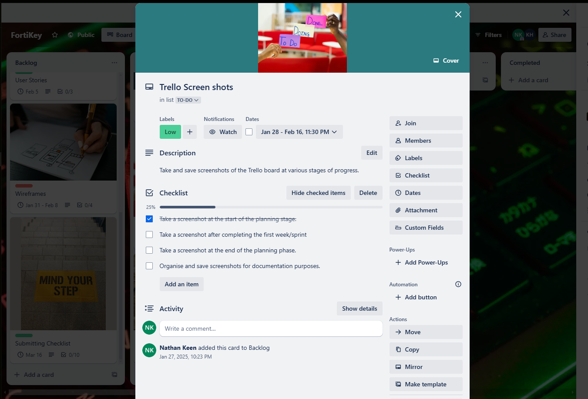
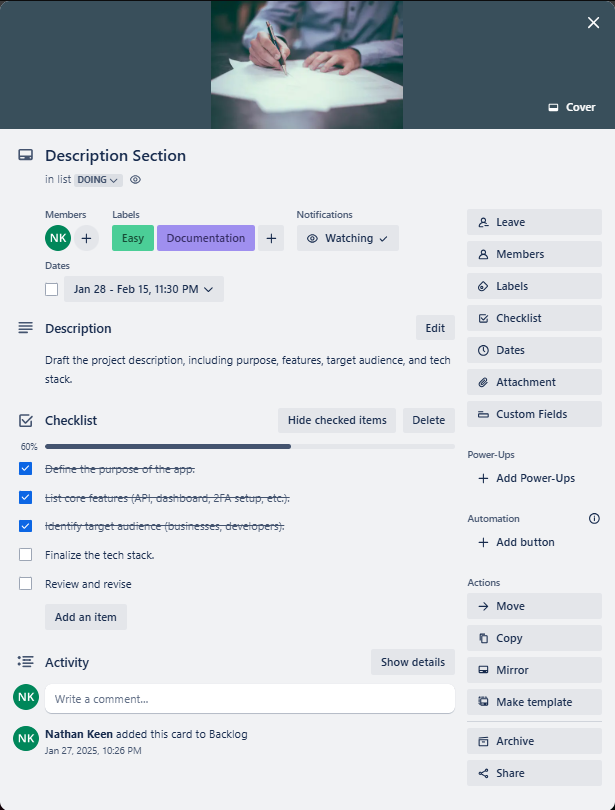
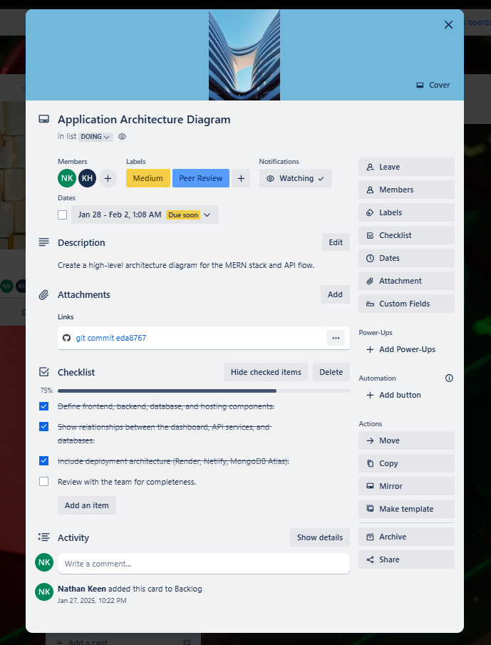
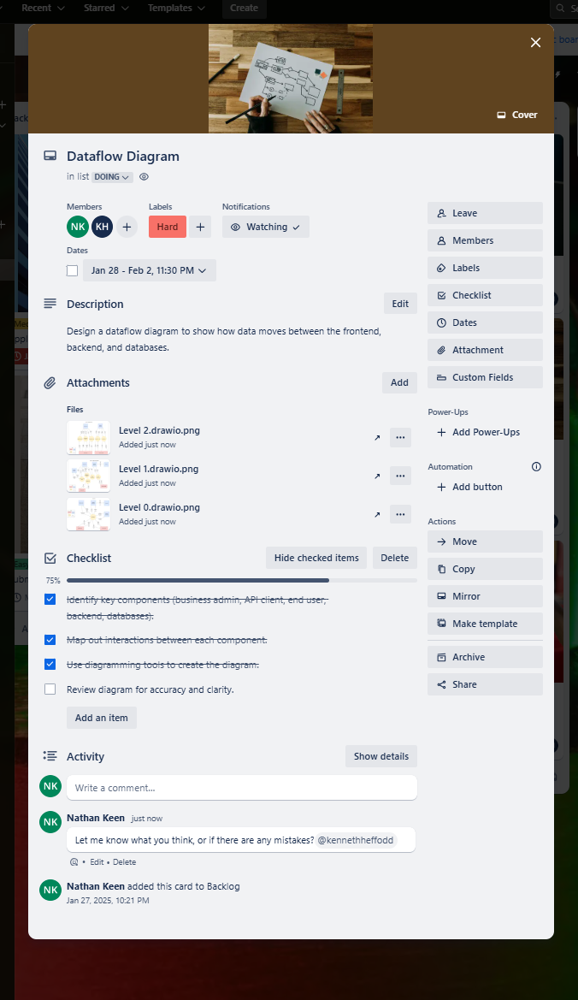
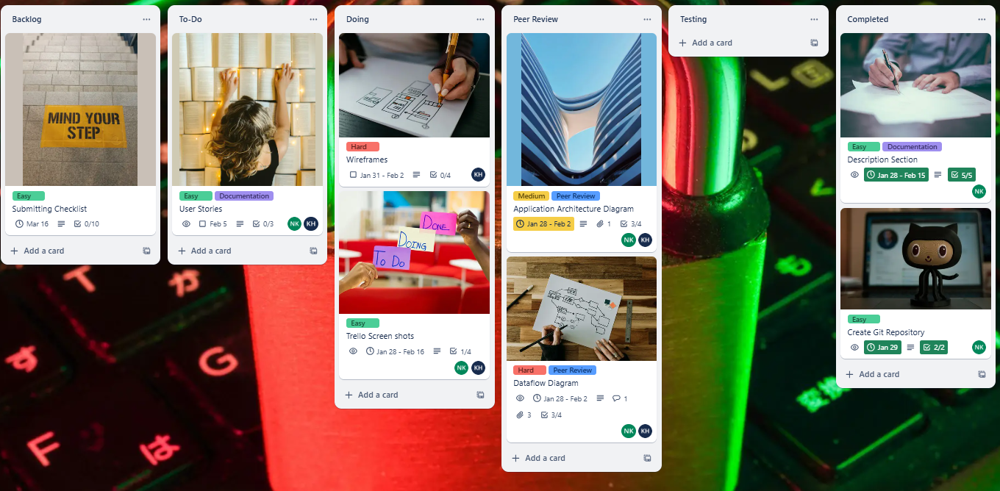

# FortiKey - Documentation T3A2-A

 ### Table of Contents:

- [Team Members](#team-members)
- [Discription](#description)
    - [Purpose](#purpose)
    - [Functionality/Features](#functionality--features)
    - [Target Audience](#target-audience)
    - [Tech Stack](#tech-stack)
    - [Additional Highlights](#additional-highlights)
- [Dataflow Diagram](#dataflow-diagram)
- [Application Architecture Diagram](#application-architecture-diagram)
- [User Stories](#user-stories)
- [Wireframes](#wireframes)
- [Trello Board](#trello-board)

### Team members

- Nathan Keen
- Kenny Hefford

## Description

### Purpose:
The purpose of this project is to provide businesses with a **easy-to-implement and secure Two-Factor Authentication (2FA) platform**.  The platform enables businesses to protect thier users' accounts from unathorised access by introducing a second layer of authentication beyond the more traditional *username and password* logins.  This platform is designed to help businesses address increasing security concerns in a cost-effective way, without requiring extensive technical expertise to intergrate the solution.  

Additionally, the platform offers a dashboard and API documentation to make integration seamless and user-friendly for developers working with businesses.

### Functionality / Features:

1. **Business Registration and Login:**
    - Businesses can register for an account using their email and password.  
    - Once logged in, they can access their API key for 2FA integration.  
    - Option to reset or regenerate API keys for security purposes.  

2. **Two-Factor Authentication API:**  
    - **Generate QR Code for TOTP Setup:** Businesses can use an endpoint to generate a QR code for their users to scan using apps like Google Authenticator or Authy.  
    - **Validate OTP:** Businesses can use another endpoint to validate OTPs entered by their users during login.  
    - **Usage Logs API:** Businesses can query usage logs to monitor 2FA activity (e.g., the number of successful and failed verifications).  

3. **Backup Codes:** 
    - Businesses can use the API to generate backup codes for users, which can be used in case they lose access to their TOTP device.  

4. **Business Dashboard:**  
    - **A web interface for businesses to:**  
        - View their account details and manage API keys.  
        - Access usage analytics (e.g., total number of 2FA verifications, failed OTP attempts).  
        - View and download API integration documentation.  
    - The dashboard will be responsive, providing seamless access on desktop and mobile devices.  

5. **API Documentation:**  
    - A detailed, developer-friendly guide to help businesses integrate 2FA into their applications.  
    - Includes examples of API requests and responses in JSON format, making the onboarding process smooth.  

6. **Security Features:**  
    - All sensitive data (e.g., passwords, API keys, TOTP secrets) is stored securely using best practices (e.g., hashed with bcrypt, encrypted TOTP secrets).  
    - API rate limiting middleware to prevent abuse (express-rate-limit library).  
    - Detailed logs and monitoring to track unauthorised attempts and system performance.  

### Target Audience:
1. **Small-to-Medium Businesses:**  
    - Companies looking for a simple, plug-and-play 2FA solution to enhance their platform's security.  
    - Businesses that don't have the technical bandwidth to build a custom 2FA solution.  

2. **Developers:**  
    - Developers tasked with adding 2FA functionality to a business's existing applications.  
    - Developers who need an easy-to-follow API with integration examples to minimise time-to-market.  

3. **Security-Conscious Enterprises:**  
    - Larger organisations seeking to add robust authentication mechanisms without diverting resources into building their own solutions.  

4. **Freelance Developers or Agencies:**  
    - Professionals providing services to *small-to-medium sized businesses* that need secure user authentication.  

### Tech Stack:  

- **Frontend:**
    - ***React.js*** (for building the business dashboard with reusable components and responsive design).  
    - ***Axios*** (for handling API requests between the dashboard and backend).  

- **Backend:**  
    - ***Node.js*** with ***Express*** (to create scalable and secure API services).  
    - ***OTPAuth*** (to handle TOTP generation and OTP validation).  
    - **Middlewares:** 
        - ***express-rate-limit*** to secure APIs from abuse and brute force attacks.  
        - ***Helmet*** Enhances security by setting HTTP headers to protect against common vulnerabilities. 
        - ***CORS*** Manages cross-origin resource sharing to allow secure communication between the frontend and backend.

- **Database:**  
    - ***MongoDB Atlas*** (a cloud database solution to store business and user-related data, including *TOTP secrets and logs*).  

- **Authentication:**  
    - ***JSON Web Tokens (JWT)*** for session and API authentication.  

- **Hosting:**  
    - **Frontend:** ***Netlify*** (for fast, reliable, and secure static hosting).  
    - **Backend:**  ***Render*** (to host backend services with scalability in mind).  

- **Additional Tools and Libraries:**  
    - ***Bcrypt*** Used to hash and securely store passwords in the database.  
    - ***Dotenv:*** Manages environment variables for configuration (e.g., API keys, database credentials).  
    - ***Winston:*** A logging library for tracking system activity, errors, and performance metrics.  
    - ***Jest:*** A testing framework for writing unit and integration tests to ensure code reliability.  

### Additional Highlights:  
1. **Scalability:**  
    - Designed to handle multiple businesses and their users with minimal latency.  
    - Can support future additions like SMS-based OTP, email verification, or push notifications.  

2. **Flexibility:**  
    - Businesses can easily integrate the API into existing applications regardless of their tech stack.  

3. **Ease of Use:** 
    - Focused on delivering an intuitive dashboard and detailed API documentation to make integration effortless.  

4. **Security:**  
    - Sensitive data (e.g., passwords, API keys, TOTP secrets) is encrypted and stored securely.
    - Rate limiting and monitoring tools prevent abuse and ensure system performance.

- [Back to Top](#table-of-contents)  

## 	Dataflow Diagram

- [Back to Top](#table-of-contents)  

## Application Architecture Diagram

### 1. Frontend (React.js App)
The frontend is a **React.js application** to be deployed on **Netlify** that serves as the user interface for businesses.  It includes a **Business Dashboard** where businesses can register, log in, manage API keys, and view usage analytics.  Additionally, it provides **API Documentation** for developers to intergrate the 2FA API into their applications.  The frontend communicates with the backend via REST API calls to handle business operations and display relevant data.  Building with **Axios** for efficient API requests and **React Router** for seamless navigation, the frontend ensures a responsive and intuitive experience across devices.  

### 2. Backend (Express.js App)  
The backend is an **Express.js Application** that handles all user/business logic and API requests.  It will be deployed on **Render** and includes an **API Gateway** to manage incoming requests, enforce rate limiting, and route requests to the appropriate services.  The backend consists of several services: the **Business Service** for registration and API key management, the **TOTP Service** for QR code Generation and OTP validation, and the **Usage Logs Service** for tracking 2FA activity.  It interacts with the database to store and retrieve data and responds to requests from the frontend and external business applications.  Building with **Node.js**, the backend is scalable and secure, leveraging middleware like **express-rate-limit** and **Helmet** to protect against abuse and vulnerabilities.  

### 3. Database (MongoDB Atlas)  
The database, built with **MongoDB Atlas**, stores all persistent data for the application. It includes two main collections: the **Business Collection**, which stores business account details, API keys, and usage logs, and the **TOTP Secrets Collection**, which stores encrypted TOTP secrets and backup codes for end users. The database communicates with the backend to provide data for business operations, TOTP management, and usage analytics. MongoDB Atlas ensures high availability, scalability, and security, making it an ideal choice for handling sensitive data like TOTP secrets and business information.  

### 4. Business Applications  
**Business Applications** are external systems developed by businesses that integrate the 2FA API. These applications interact with the backend to provide 2FA functionality to their end users. They request QR codes for TOTP setup, send OTPs for validation, and handle user interactions (e.g., displaying QR codes and prompting for OTPs). The backend processes these requests and returns the necessary data (e.g., QR codes, validation results) to ensure secure authentication. The API is designed to be **tech stack-agnostic**, allowing businesses to integrate 2FA seamlessly into their existing applications, regardless of their programming language or framework.

- [Back to Top](#table-of-contents)  

## User Stories

- [Back to Top](#table-of-contents)  

## Wireframes 

- [Back to Top](#table-of-contents)  

## Trello Board

  

   

  

  

  

- [Back to Top](#table-of-contents)